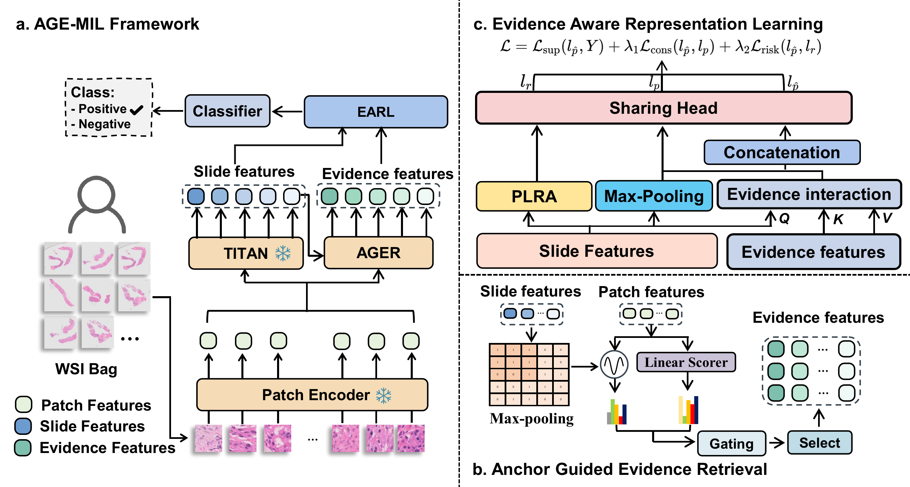

# AGE-MIL

Implementation for **AGE-MIL: Anchor-Guided Evidence Learning for Patient-Level Prediction**.

## Project Overview

Existing computational pathology methods predominantly operate within whole-slide image (WSI)-level multiple instance learning (MIL) paradigms, while patient-level modeling remains underexplored. In routine pathological practice, pathologists derive diagnostic and prognostic conclusions by integrating evidence across multiple WSIs rather than relying on any single slide.

AGE-MIL is a weakly supervised framework for patient-level prediction. It constructs a patient-level anchor from slide representations to capture global pathological context and guide the retrieval and integration of diagnostically relevant local patches. Patient-level risk is further modeled as an evidence accumulation process, promoting stable optimization under weak supervision.

## Framework Overview




## Repository Structure

```text
agemil/
├── architecture/
│   └── dual_view.py              # Dual-view AGE-MIL model
├── config/
│   └── config.yml          # Example training configuration
├── datasets/
│   └── dual_view_datasets.py     # Patient-level data loading
├── utils/
│   ├── file_utils.py
│   └── utils.py
├── dualview_train.py             # Main training script
├── engine.py                     # Training and evaluation loops
└── environment.yml             # Python dependencies
```

## Installation & Training

Clone the repository and create a Python environment:
```bash
git clone https://github.com/wodeniua/AGE-MIL.git
cd AGE-MIL

conda env create -f environment.yml
conda activate age-mil

python dualview_train.py --config config/config.yml
```
